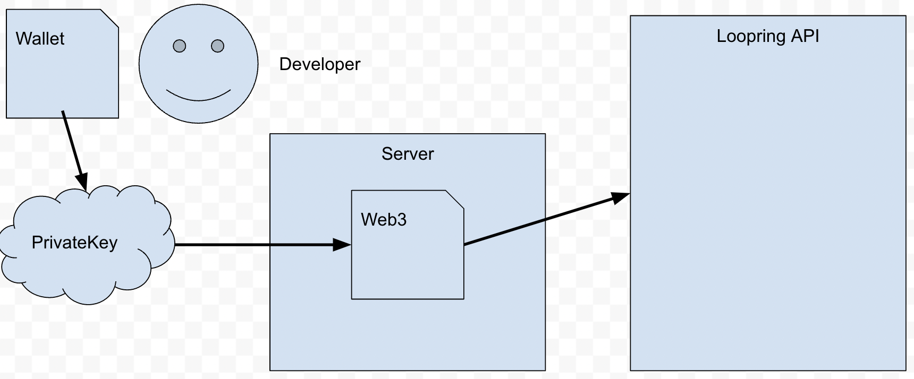
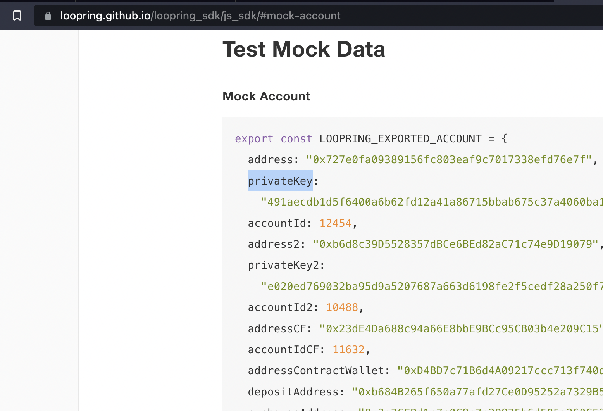

## THIS README IS A WORK IN PROGRESS! 

There is incomplete install steps below, i'm publishing so that SOME info is available, but I'm traveling so it might take a while to for me to finish :(.


# Web3 Example using GameStop Wallet (Loopring JS SDK)

It's taken me many hours to cobble together a working frontend example from the Loopring.io JavaScript SDK, so I thought I'd boil down my progress to a few working examples so people don't have to reinvent the wheel.


## How is this different from the SDK docs posted by [loopring](https://loopring.github.io/loopring_sdk/)?

The documentation has an 'implied' architecture in a sense. That architecture is that you, the developer, are trying to access the api/exchange:



This is evident by the fact all that all examples have you exporting your private key into a 'mock' account.



Now, I don't know about you, but there are very few users that I'm aware of who are willing to export their private key in order to use an app on they found on the internet. As such, we need to expand on these examples to be front-end (re: website) friendly. In otherwords, we need to build a system/dapp allows a user to lean on their wallet for interacting with the api, no private key export necessary.

## How To:

Now, I might be way off base in this solution, but it works and makes sense to my smooth brain. The high level setup is as follows:

0. Create a simple node.js website using express
1. Transpile/convert the loopring node module to a browser compatable .js file
2. Src that file in an html file served via Express JS
3. Initilalize the web3 library using the gamestop wallet as the provider
4. Build loopring compliant requests and pass them through the gs wallet for signatures
5. ???
6. Profit!

## 0: Create a simple node.js webiste

Unforutnately, you have to server web3 enabled content from a server or middleware like express. If you did all these steps and just saved it as mynewapp.html and opened it in a browser, none of wallets will inject their provider into the page to access, so nothing will run.  To get up and running, the simplest node app with express can be used:

1. Install [node](https://nodejs.org/en/) and add it to your path so that typing 'node' and 'npm' in the command line displays the help text (not an error)
2. Create a node app and Install [express](https://expressjs.com/en/starter/installing.html)
3. Get the [hello world](https://expressjs.com/en/starter/hello-world.html) app working

## 1: Transpile Loopring SDK Module using Browserify and ESMify plugin

I've already done this step for the version of loopring as of the last update on this repo (see src/loopring.js), but if you need a later/different version, follow these steps:

1. Install browserify esmify and browser-resolve
   ```bash
   npm install browserify esmify browser-resolve
   ```
2. Install Loopring 
   ```bash
   npm install @loopring-web/loopring-sdk
   ```
3. Find the minified loopring source and run the browserify file command. This will output it to the root direcorty (top level) of your node app. If your loopring-sdk.esm.js file is in a different location, change the file directory below (node_modules/@loopring-web/loopring-sdk/dist/loopring-sdk.esm.js) as needed
   
```bash
browserify node_modules/@loopring-web/loopring-sdk/dist/loopring-sdk.esm.js -p esmify > loopringsdk.js
```
4. You should now have a file in your parent directly called loopringsdk.js. Make a directory called src and move it there
   ```bash
   mkdir src
   mv loopringsdk.js src
   ```

TLDR: just use the one in the src dir of this repo.

## 2: Src that file in an html file served via Express JS

Next up, let's server a page that access the browser compatibable sdk!

1. Create an html page in the head tag, include our dependancies. We'll need one more file (web3.js) beyond the above, but that's got an easy cdn link already
   
```html
<head>
    <!-- We created this in step 1, but it's included in teh src dir here as well -->
    <script src="/src/loopringsdk.js"></script>
    <!-- We need this to use web3 wallets-->
    <script src="https://cdn.jsdelivr.net/gh/ethereum/web3.js@1.0.0-beta.34/dist/web3.min.js"></script>
    <!-- I like to use this for pretty buttons, you can skip it-->
    <link href="https://cdn.jsdelivr.net/npm/bootstrap@5.1.3/dist/css/bootstrap.min.css" rel="stylesheet" integrity="sha384-1BmE4kWBq78iYhFldvKuhfTAU6auU8tT94WrHftjDbrCEXSU1oBoqyl2QvZ6jIW3" crossorigin="anonymous">
</head>
```

2. Create a route in the app.js file created in step 0


## 3: Initilalize the web3 library using the gamestop wallet as the provider

Now we can use just about everying in the sdk from the browser! We just need to create a web3 object and prompt the user to connect their wallet! To do this, let's give the user a button for each type of wallet we support:
   
```html
<div id="connnect">
    <button type="button" class="btn btn-primary" id="connectWallet" onclick="gameStop();">Gamestop Wallet</button>
    <button type="button" class="btn btn-danger" id="disconnectWallet" onclick="provider.disconnect();">Disconnnect Wallet</button>
</div>
```
   
1. You'll notice our buttons call functions when they're clicked, we need to create those! Add them in a ```<script>``` tag at the bottom of your page

```html
<script>
async function gameStop(){
    // some users might not have gamestop wallet yet, account for that!
    if( typeof gamestop !== 'undefined'){
        //activate the gamestop provider
        await gamestop.enable();
    } else {
        // show an error for users without gamestop wallet
        alert('You need to install the gamestop wallet via the chrome web store.');
    }
}
</script>
```

## 4: Build loopring compliant requests and pass them through the gs wallet for signatures

Now the real work begins! Below are a few examples of interfacing wiht the sdk! 

```javascript
let sdk = window.Bundle;

class LoopringAPIClass{
  constructor(sdk) {
    let chainId = sdk.ChainId.MAINNET;
    this.userAPI = new sdk.UserAPI({ chainId });
    this.exchangeAPI = new sdk.ExchangeAPI({ chainId });
    this.globalAPI = new sdk.GlobalAPI({ chainId });
    this.ammpoolAPI = new sdk.AmmpoolAPI({ chainId });
    this.walletAPI = new sdk.WalletAPI({ chainId });
    this.wsAPI = new sdk.WsAPI({ chainId });
    this.nftAPI = new sdk.NFTAPI({ chainId });
    this.delegate = new sdk.DelegateAPI({ chainId });
    //this.generateKeyPair = sdk.generateKeyPair();
    this.ConnectorNames = sdk.ConnectorNames;
    this.UserNFTTxTypes = sdk.UserNFTTxTypes;
    this.__chainId__ = chainId;
    this.contractAPI = sdk.ContractAPI;
    this.KEY_MESSAGE = sdk.KEY_MESSAGE;
    this.generateKeyPair2 = sdk.generateKeyPair2;
    this.generateKeyPair = sdk.generateKeyPair;

  };
}

class LoopringAccount {
  constructor(address){
    this.address = address;
    this.privateKey = '';//"491aecdb1d5f6400a6b62fd12a41a86715bbab675c37a4060ba115fecf94083c";
    this.accountId =  0;  //12454;
    this.accInfo = {}; //
    this.exchangeAPI = '';  //"0x2e76EBd1c7c0C8e7c2B875b6d505a260C525d25e";
    this.chainId = 1;
    this.nftTokenAddress =  '';  //"0x8394cB7e768070217592572582228f62CdDE4FCE";
    this.nftTokenId =  0;  //32768;
    this.nftId =  '';  //"0xa0ce8990402955e559799af24ea765b14ffecc32dfa1cce2dadaf20016b074e6";
    this.nftData =  '';  //"0x1a2001aac7a1fd00cef07889cdb67b1355f86e5bc9df71cfa44fa1c7b49f598f";
    this.gasPrice =  0;  //20; // for test
    this.gasLimit =  0;  //200000; // for test
    this.validUntil = Math.round(Date.now() / 1000) + 30 * 86400;
    this.CUSTOMER_KEY_SEED = "XXXXXX" + " with key nonce: " + "${nonce}";
  }
}

async function signatureKeyPairMock(LOOPRING_EXPORTED_ACCOUNT, LoopringAPI) {
  console.log(LOOPRING_EXPORTED_ACCOUNT.account);
  let keyseed = ''
  if (LOOPRING_EXPORTED_ACCOUNT.account.accInfo.keySeed != ''){
      keyseed= LOOPRING_EXPORTED_ACCOUNT.account.accInfo.keySeed
  } else {
      keyseed = LoopringAPI.KEY_MESSAGE.replace(
        "${exchangeAddress}",
        LOOPRING_EXPORTED_ACCOUNT.exchangeAPI.exchangeInfo.exchangeAddress
      ).replace("${nonce}", (LOOPRING_EXPORTED_ACCOUNT.account.accInfo.nonce - 1).toString())
  }
  const parms = {
    web3: window.web3,
    address: LOOPRING_EXPORTED_ACCOUNT.address,
    keySeed:keyseed,
    walletType: LoopringAPI.ConnectorNames.MetaMask,
    chainId: LoopringAPI.__chainId__,
  }
  console.log(parms);
  const eddsaKey = await LoopringAPI.generateKeyPair(parms); // can use gamestop.request({ method: 'personal_sign',params:["test","0xe5B6B887570Ae0EC87B379e1576C4fe0b892BA38",""] }) here I think
  //const sig = await window.gamestop.request({ method: 'personal_sign', params:[parms.keySeed,parms.address,""] });
  //const eddsaKey = await LoopringAPI.generateKeyPair2(sig);
  return eddsaKey;
}

async function setupWeb3User(address) {
    if (typeof sdk == 'undefined') var sdk = window.Bundle;
    // if (typeof WEB3 == 'undefined') var WEB3 = new Web3;
    let LoopringAPI = new LoopringAPIClass(sdk);
    const LOOPRING_EXPORTED_ACCOUNT = new LoopringAccount(address);
    LOOPRING_EXPORTED_ACCOUNT.exchangeAPI = await LoopringAPI.exchangeAPI.getExchangeInfo()
    LOOPRING_EXPORTED_ACCOUNT.account = await LoopringAPI.exchangeAPI.getAccount({
        owner: LOOPRING_EXPORTED_ACCOUNT.address,
      });
    LOOPRING_EXPORTED_ACCOUNT.accountId = LOOPRING_EXPORTED_ACCOUNT.account.accInfo.accountId;
    console.log('Got account:',LOOPRING_EXPORTED_ACCOUNT.account);
    
    window.web3 = new Web3(window.gamestop);
    const eddsaKey = await signatureKeyPairMock(LOOPRING_EXPORTED_ACCOUNT, LoopringAPI);
    LOOPRING_EXPORTED_ACCOUNT.eddsaKey = eddsaKey;
    LOOPRING_EXPORTED_ACCOUNT.apiKeyData = await LoopringAPI.userAPI.getUserApiKey({
      accountId: LOOPRING_EXPORTED_ACCOUNT.account.accInfo.accountId}, eddsaKey.sk
    );
    window.LOOPRING_EXPORTED_ACCOUNT = LOOPRING_EXPORTED_ACCOUNT;
    window.LoopringAPI = LoopringAPI;
    console.log('connected!');
    getNFTs();
    return true;
}

async function getStorageId(nftTokenId){
  let request = {
    accountId:  window.LOOPRING_EXPORTED_ACCOUNT.account.accInfo.accountId,
    sellTokenId: nftTokenId ?? window.SELECTED_NFT.tokenId,
  };
  let apiKey = window.LOOPRING_EXPORTED_ACCOUNT.apiKeyData.apiKey;
  const storageId = await window.LoopringAPI.userAPI.getNextStorageId(request, apiKey);
  return storageId;
}

async function getGasFee(){
  let request = {
    accountId:  window.LOOPRING_EXPORTED_ACCOUNT.account.accInfo.accountId,
    requestType: window.Bundle.OffchainNFTFeeReqType.NFT_TRANSFER,
    amount: "0",
  };
  let apiKey = window.LOOPRING_EXPORTED_ACCOUNT.apiKeyData.apiKey;

  const fee = await  window.LoopringAPI.userAPI.getNFTOffchainFeeAmt(request,apiKey);
  console.log("fee:", fee);
  document.getElementById("gas").textContent='Current Gas In Ether: ' + Web3.utils.fromWei(fee.fees['ETH'].fee,'ether')
  return fee.fees;
}
```

---
TO DO: Make sense of my examples. Add ejs how to because serving native html is ugly.
